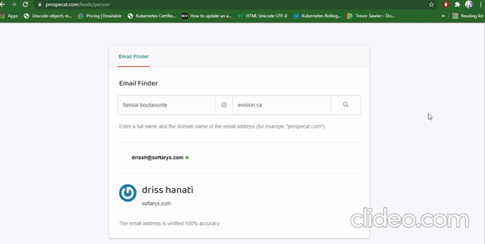
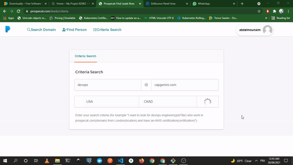
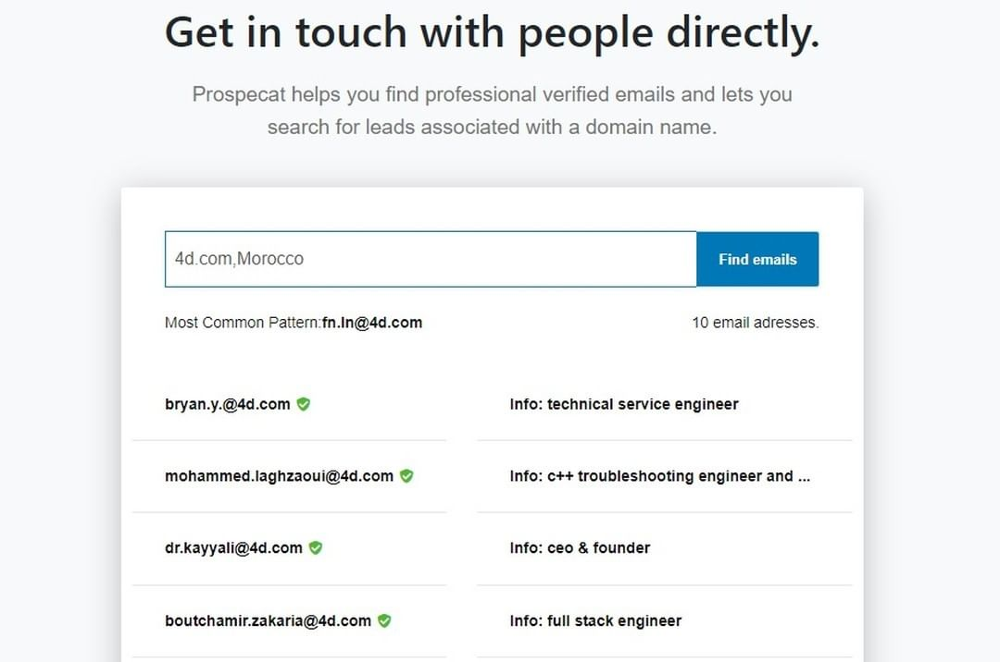
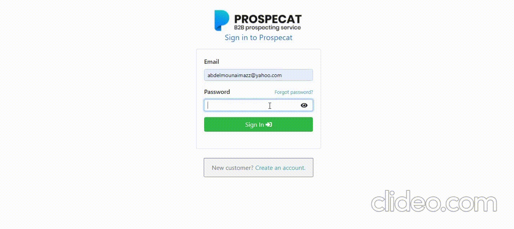
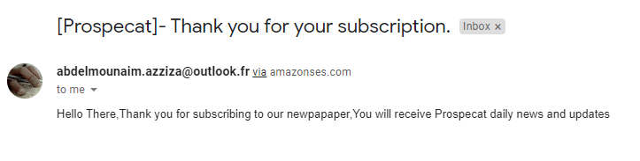

# Prospecat

**Prospecat** is a B2B prospecting platform. Use it to find email addresses and build a quality B2B Data for your sales funnel.

## App architecture

## code sharing

all services share some logic between them,such as seeing if user loged in,custom error handling.[azz-prospecat](https://www.npmjs.com/package/azz-prospecat "common library") serves as a common library to share code with these services instead of just copy pasting.

---

## Demo

### Find Verified Email

### Criteria Search

### Find Email By Domain

### Authentification

### Payment plans

### AWS Email notification

## Author

Abdelmounaim Azziza [@abdelmounaimazz](https://twitter.com/AbdelmounaimAzz "abdelmounaimazz").